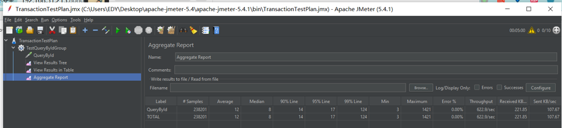
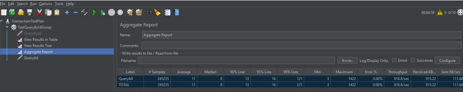

# Transaction Demo

A Spring Boot Demo for managing transactions with in-memory storage.

## Features

- Create, read, update, and delete transactions
- In-memory storage with caching
- Comprehensive error handling
- Containerization support

## Technologies Used

- Java 21
- Spring Boot 3.2.3
- Maven
- Caffeine Cache
- JUnit
- Docker

### External Libraries

- **Lombok**: Reduces boilerplate code with annotations
- **Caffeine**: High-performance caching library
- **Spring Boot Validation**: Input validation
- **Spring Boot Test**: Testing framework

## Transactions

- `POST /api/transactions`: Create a new transaction
- `GET /api/transactions/{id}`: Get a transaction by ID
- `PUT /api/transactions/{id}`: Update a transaction
- `DELETE /api/transactions/{id}`: Delete a transaction
- `GET /api/transactions`: List all transactions (paginated)
- `GET /api/transactions/account/{userId}`: List transactions by userId (paginated)

## Running the Application

### Prerequisites

- Java 21
- Maven
- Docker (optional)

### Local Development

1. Clone the repository
2. Run the application: `./mvnw spring-boot:run` or just run `TransactionServiceApplication`

### Docker

1. Build the Docker image:
   ```bash
   docker build -t transaction-demo .
   ```

2. Run the container:
   ```bash
   docker run -p 8080:8080 transaction-demo
   ```
   
## Stress Test

Alert: Just test for 300 seconds with 10 threads for demo purposes.

### Environment 

- Jmeter 5.4.1
- Docker container with single transaction demo running
- Seperated computer connected via wifi

### Result

#### Query Transaction By Id

| Threads | Duration | Samples | Average Response Time | Min Response Time | Max Response Time | Error Rate | Throughput |
|---------|----------|---------|------------------------|--------------------|--------------------|------------|---------|
| 10      | 300      | 238201  | 12ms                   | 3ms                | 1421ms             | 0.00%      |622.9/sec|


#### Query All Transactions

| Threads | Duration | Samples | Average Response Time | Min Response Time | Max Response Time | Error Rate |Throughput|
|---------|----------|---------|-----------------------|--------------------|-------------------|------------|---------|
| 10      | 300      | 245235  | 11ms                  | 3ms                | 1422ms            | 0.00%      |816.6/sec|



#### ...